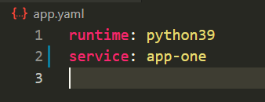
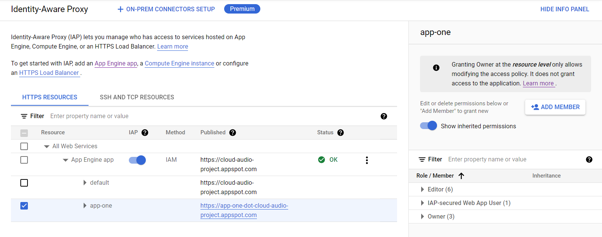
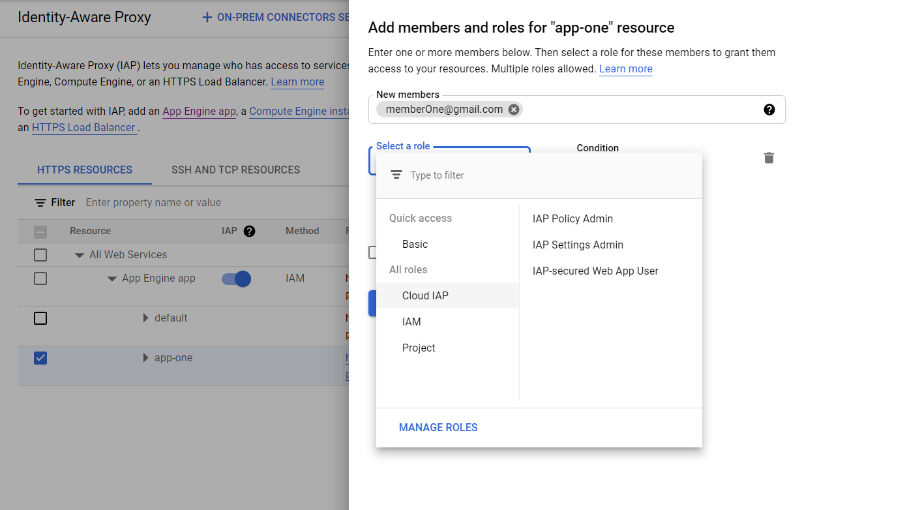
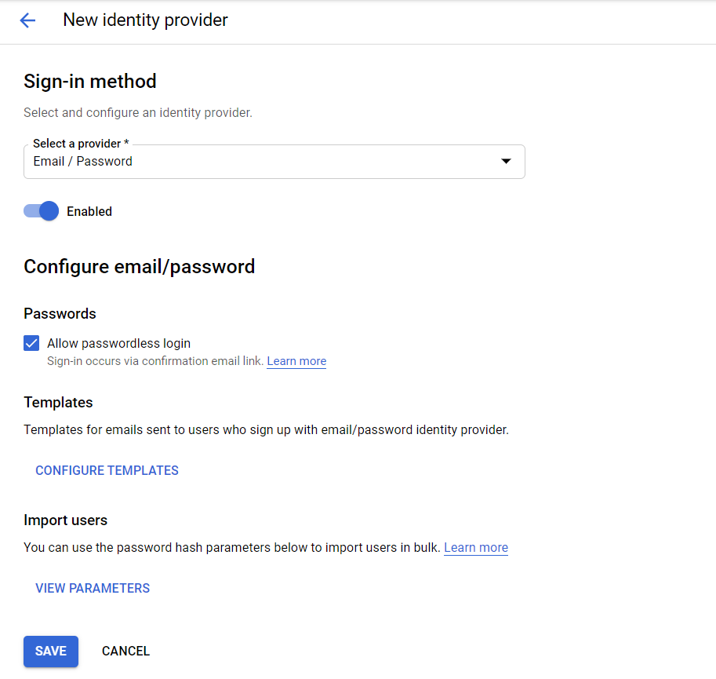
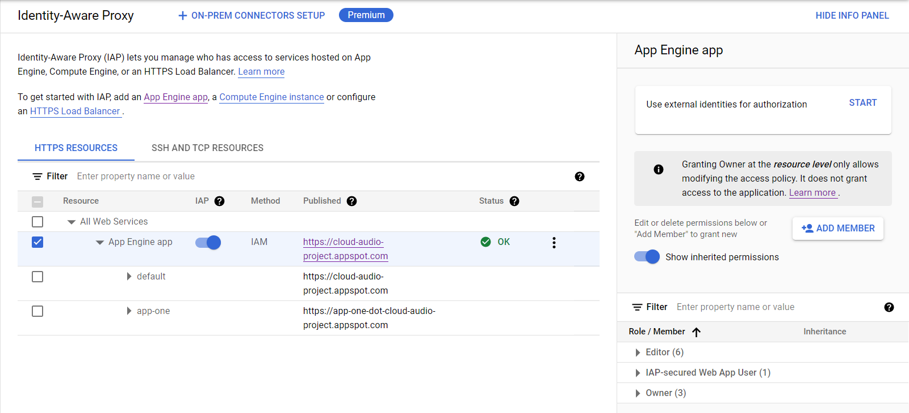
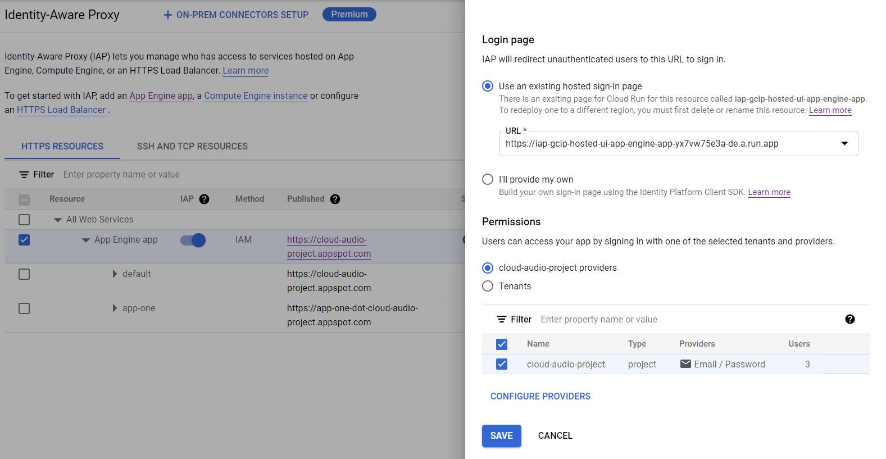

# Adding IAP to your application deployed on Google App Engine

## Google/G Suite Accounts
- Enable App Engine
- Create app.yml in project root
 
  

- Deploy app to App Engine
  
  ```gcloud app deploy```

- Enable Identity-Aware Proxy
- Select your app from the list under App Engine App
  
  

- ### Add Users
  
  Click Add Member. Enter a gmail/iam/gsuite email address.
  In role, select Cloud IAP -> IAP-secured Web App User
  Click save. The user sign in to the app now.
  
  

## External Identities
- ### Enable Identity Platform

- ### On the Identity Platfrom main page, click Add Provider in the Providers tab (left sidebar).

- ### Select Email/Password from the dropdown
  
  (or any other provider if you want to sign in via Facebook or Twitter for example).

- ### Check Enabled and then Save.
  
  


- ### Back on the IAP page, select App Engine app and click Start in the right sidebar.
  
  

- ### Select Email/Password from the providers list.
  
  For convenience, use the existing sign in page. Click Save.
  
  

- ### Import Users to Identity platform using the import_users.py script.
  
  You should see your imported users in the Users tab on the Identity Platform page.

- ### Sign in your users using the example script in login_page.html

- ### You can disable automatic sign up from the Settings tab on the Identity Platform page.